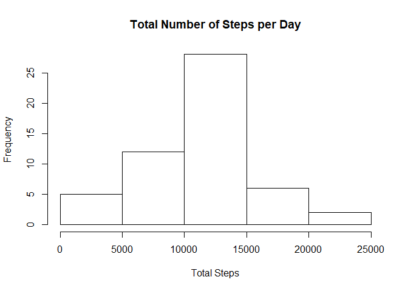
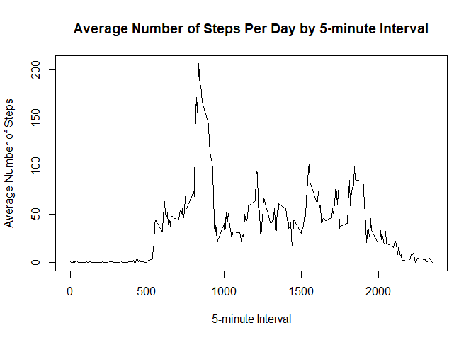
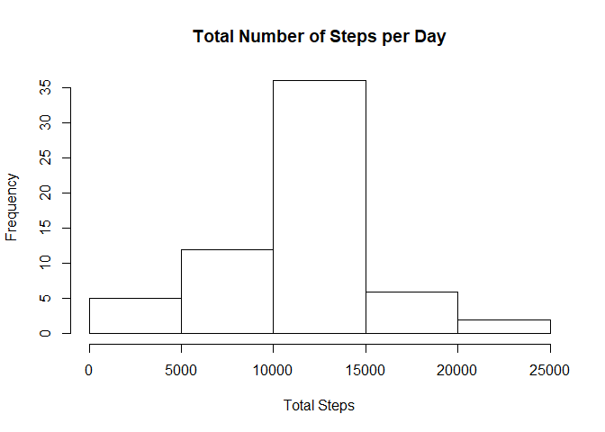
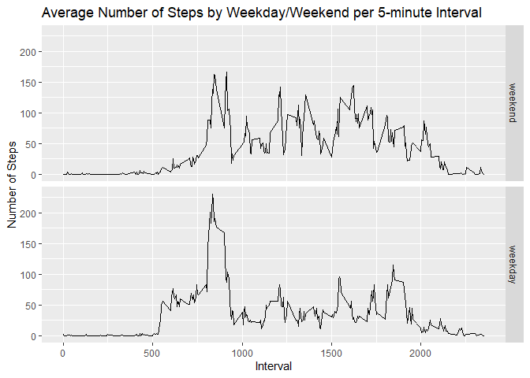

## Loading and preprocessing the data

The code below loads the activity data into R and also converts the date into the correct format.


```r
data <- read.csv("activity.csv", colClasses = c("integer", "Date", "integer"))
```

The packages used in the analysis also need to be loaded.


```r
library(dplyr)
library(ggplot2)
```

## What is the mean total number of steps taken per day?

The total number of steps taken per day is calculated using the below code. A summary of the table is provided for reference.


```r
totalstep <- data %>% group_by(date) %>% summarise(totalsteps = sum(steps))
totalstep
```

```
## # A tibble: 61 x 2
##    date       totalsteps
##    <date>          <int>
##  1 2012-10-01         NA
##  2 2012-10-02        126
##  3 2012-10-03      11352
##  4 2012-10-04      12116
##  5 2012-10-05      13294
##  6 2012-10-06      15420
##  7 2012-10-07      11015
##  8 2012-10-08         NA
##  9 2012-10-09      12811
## 10 2012-10-10       9900
## # … with 51 more rows
```

The following histogram shows the total number of steps taken per day using the base plotting system.


```r
hist(totalstep$totalsteps, main = "Total Number of Steps per Day", xlab = "Total Steps")
```

<!-- -->

The mean and median of the total number of steps is reported below, with the missing values being removed from the calculation.


```r
print(mean(totalstep$totalsteps, na.rm = TRUE))
```

```
## [1] 10766.19
```

```r
print(median(totalstep$totalsteps, na.rm = TRUE))
```

```
## [1] 10765
```

## What is the average daily activity pattern?

The following time series plot shows the average number of steps taken (averaged across all days) by 5-minute intervals. The base plotting system has been used for this graph.


```r
avgint <- data %>% group_by(interval) %>% summarise(avgint = mean(steps, na.rm = TRUE))

with(avgint, plot(interval, avgint, type = "l", xlab = "5-minute Interval", ylab = "Average Number of Steps"))
with(avgint, title(main = "Average Number of Steps Per Day by 5-minute Interval"))
```

<!-- -->

The 5-minute interval, on average across all days, containing the maximum number of steps is 835, as reported below:


```r
print(avgint[which.max(avgint$avgint), ])
```

```
## # A tibble: 1 x 2
##   interval avgint
##      <int>  <dbl>
## 1      835   206.
```

## Imputing missing values

The code below shows the total number of missing values in the dataset.


```r
print(sum(is.na(data)))
```

```
## [1] 2304
```

As noted above, there are a number of missing values in the dataset which require filling in. As the time of day makes a substantial difference in the number of steps taken, I have used the mean for the relevant 5-minute interval to replace the missing values. 

The following code creates a new dataset that is equal to the original dataset but with the missing data filled in.


```r
newdata <- data
newdata$steps <- ave(newdata$steps, newdata$int, FUN = function(x)
    ifelse(is.na(x), mean(x, na.rm = TRUE), x))
```

The following histogram (created using the base plotting system) shows the total number of steps taken per day with the missing data imputed.


```r
totalstep2 <- newdata %>% group_by(date) %>% summarise(totalsteps = sum(steps))
hist(totalstep2$totalsteps, main = "Total Number of Steps per Day", xlab = "Total Steps")
```

<!-- -->

Below is the mean and median of the total number of steps taken per day.


```r
print(mean(totalstep2$totalsteps, na.rm = TRUE))
```

```
## [1] 10766.19
```

```r
print(median(totalstep2$totalsteps, na.rm = TRUE))
```

```
## [1] 10766.19
```

The mean has is consistent between the original and the new data set, whereas the median has increased by a minor amount. This change is due to the fact that the missing data was imputed using the mean of the relevant 5-minute interval. 

By imputing missing data, total number of steps increases as steps are being added into the dataset based on the mean of non-missing values. 

## Are there any differences in activity patterns between weekdays and weekends?

The code below creates a new factor varaible with two levels ("weekday" and "weekend") which indicates whether a given date is a weekday or a weekend day. 


```r
weekday <- c("Monday", "Tuesday", "Wednesday", "Thursday", "Friday")
newdata$DateClass <- factor((weekdays(newdata$date) %in% weekday), 
    levels = c(FALSE, TRUE), labels = c("weekend", "weekday"))
```

The following panel plot shows time series data of the 5-minute interval and the average number of steps taken, averaged across weekdays and weekends. This plot was created using the ggplot2 package.


```r
avgweekclass <- aggregate(steps ~ DateClass + interval, data = newdata, mean)

ggplot(avgweekclass, aes(interval, steps)) + geom_line() + facet_grid(DateClass~.) +
    labs(title = "Average Number of Steps by Weekday/Weekend per 5-minute Interval",
         x = "Interval", y = "Number of Steps")
```

<!-- -->
